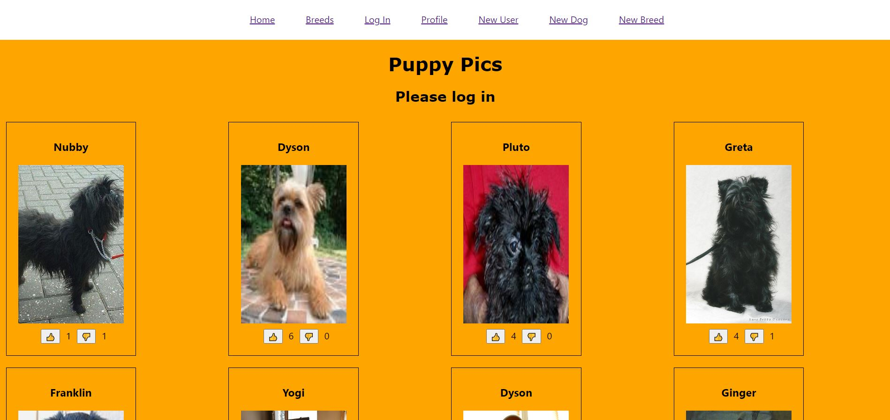
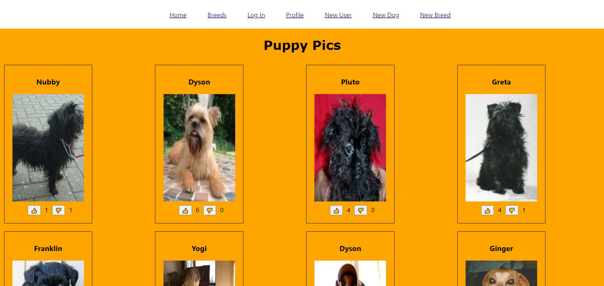
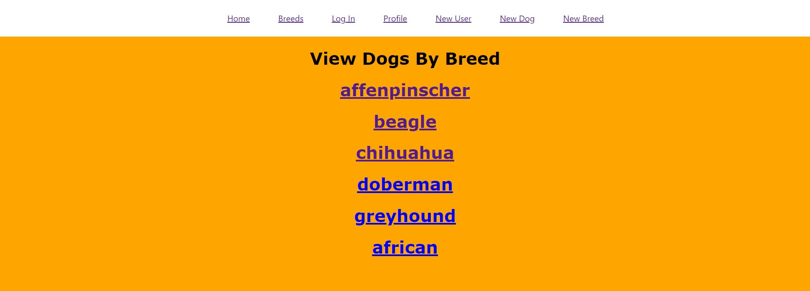
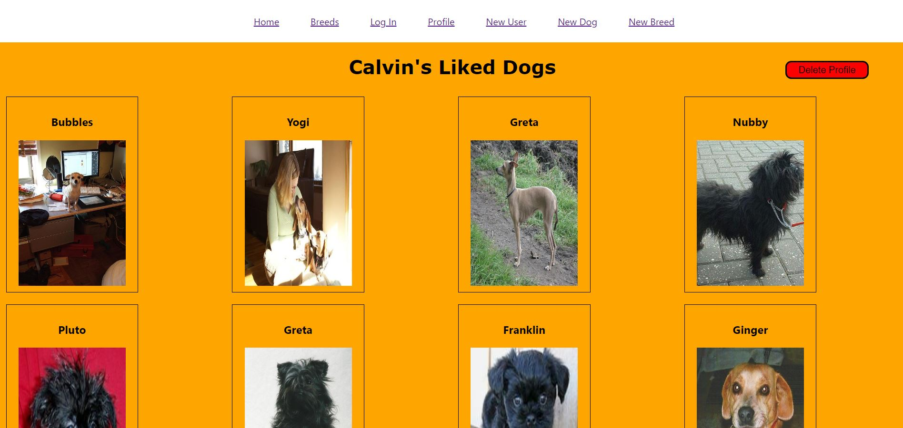
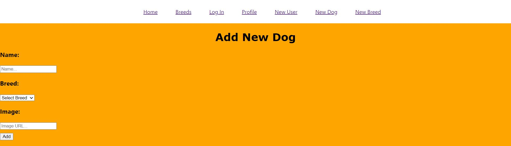
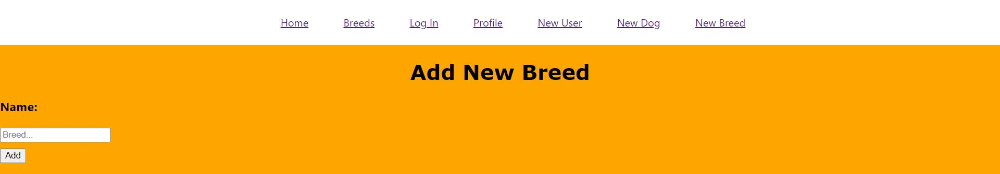

# [Puppy Pics App](https://puppypics.netlify.app/)
> [Backend Repo](https://github.com/Calvinfr96/puppy-pics-backend)

Puppy Pics is a full stack, single-page web application built using React.js and Ruby on Rails.
Routing is implemented using React Router and Authentication is implemented on the front end using State.
Here, users can view and rate dogs of various breeds. Users can also contribute by adding new dog images and new dog breeds.

To rate dogs, users must first log into an existing account or create a new account by providing a name:

Once logged in, users can rate dogs by navigating to the home page: 

Users can also filter dogs by breed by navigating to the Breeds page and clicking on a breed to view images of that breed:

Users can navigagate to the profile page to view dogs they have liked or delete their profile:

To contribute to the collection of images, users can add a dog that belongs to an existing breed:

Users can also add dogs that belong to different breeds by creating the breed first, then adding the image:

